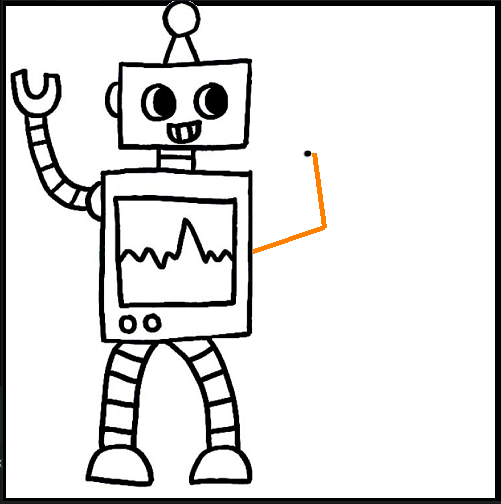
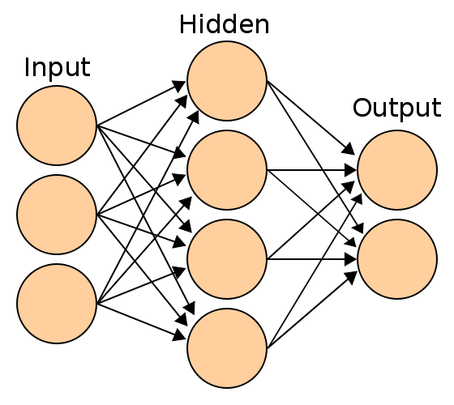

# Neural Hand
Neural Hand is application with robot which learn position his hand to point. It is possible becouse of implemented artificial neural network. 


## Requirements
* matplotlib
* numpy
* pygame

## Theory
My implementation of artificial neural network([Multi-layer perceptron](https://en.wikipedia.org/wiki/Feedforward_neural_network)) is base on [backpropagation](https://en.wikipedia.org/wiki/Backpropagation). Learning  neural network is about change weights of connection between neurons.



## Start
To run application:

```python robot-ex3.py```

then wait till lost plot will appears. After close plot it will open main app. 

## Hyperparameters

It is posible to specify size of neural network in `robot-ex3.py` file 39 line. It is required to leave input size on 2 (
co-ordinates) and  leave output size on 2 (arm angles).

```NN = NeuralNetwork(layers=(2,10,2)) ```

